# MoiApp — User Stories & Flow Diagrams

## Table of Contents
1. [Authentication & Login](#1-authentication--login)
2. [Event Creation & Management](#2-event-creation--management)
3. [Moi Entry & Guest Payment](#3-moi-entry--guest-payment)
4. [Admin Dashboard](#4-admin-dashboard)
5. [Admin User Management](#5-admin-user-management)
6. [Admin Analytics](#6-admin-analytics)
7. [Admin Support & Complaints](#7-admin-support--complaints)
8. [App Settings / Feature Toggles](#8-app-settings--feature-toggles)
9. [Notifications](#9-notifications)
10. [Reports & Export](#10-reports--export)
11. [Invitation Upload](#11-invitation-upload)
12. [Reminders](#12-reminders)

---

## 1. Authentication & Login

### 1.1 Phone/OTP Login
**User Story:** As a user, I want to log in with my phone number and OTP, so that I don't need to remember a password.

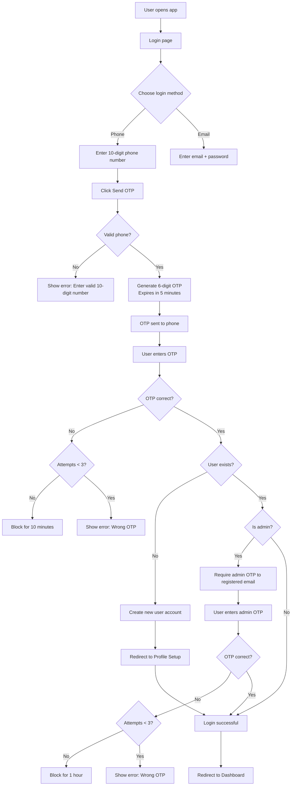

**Key Rules:**
- 10-digit phone validation
- 6-digit OTP, 5-minute expiry
- 3 wrong attempts → 10-minute block
- New users → `needsProfile: true` → Profile Setup
- Admin users → additional email OTP step
- Admin wrong password 3 times → 1-hour lockout

---

### 1.2 Admin Login (Email + Password + OTP)
**User Story:** As an admin, I want secure login with email, password, and OTP, so that only authorized admins can access admin features.

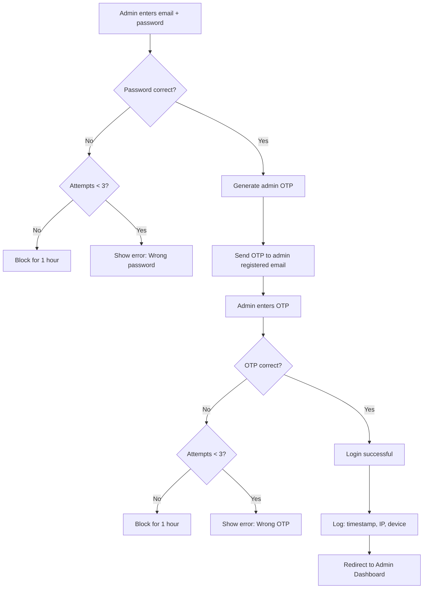

**Key Rules:**
- Email + password first
- OTP sent to admin's registered email
- 3 wrong password attempts → 1-hour lockout
- Login audit logs with IP/device/timestamp

---

## 2. Event Creation & Management

### 2.1 New Event Creation (Past vs New)
**User Story:** As a host, I want to create either a Past Event or a New Event, so that I can record past moi or collect new moi.

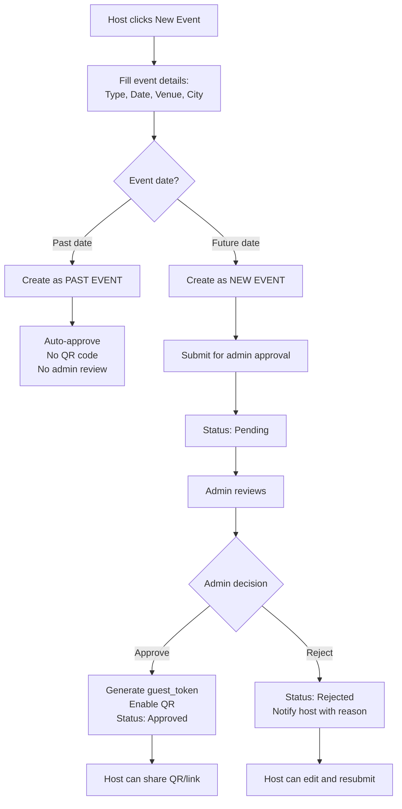

**Key Rules:**
- Past event: date ≤ today, no approval, no QR
- New event: date ≥ today, pending approval, QR on approval
- Auto-generated name: `"Function Type - Date"` (e.g., `"Wedding - 15 Jan 2025"`)
- Venue and City are optional

---

### 2.2 QR Code Management
**User Story:** As a host, I want to manage my event's QR code, so that I can control guest access.

```mermaid
flowchart TD
    A[Event approved] --> B[QR code generated<br/>Unique guest_token]
    B --> C[Host sees QR panel]
    C --> D{QR actions}
    D -->|Download| E[Download 800x800 PNG]
    D -->|Share| F[WhatsApp share with link]
    D -->|Copy| G[Copy payment link]
    D -->|Close| H[qr_enabled = 0<br/>Guests see "closed" message]
    D -->|Regenerate| I[New guest_token generated<br/>Old QR immediately stops working]
    H --> J[Host can reopen QR]
    I --> K[Host shares new QR]
```

**Key Rules:**
- QR only for approved new events
- Close QR → guests see "event no longer accepting moi"
- Regenerate QR → old token invalid, new token active
- QR image: black on white, print-friendly

---

### 2.3 Private Event Access Control
**User Story:** As a host, I want my event to be private, so that only invited guests with the QR/link can submit moi.

```mermaid
flowchart TD
    A[Guest scans QR / opens link] --> B[Backend: GET /events.php?guest_token=XYZ]
    B --> C{Token exists?}
    C -->|No| D[Error: private_event<br/>"You need an invitation"]
    C -->|Yes| E{Event active?}
    E -->|No| F[Error: Invalid/expired link]
    E -->|Yes| G{Approved & QR enabled?}
    G -->|No| H[Error: event_closed<br/>"Contact the host"]
    G -->|Yes| I[Show payment form]
    I --> J[Guest fills form]
    J --> K[Submit moi]
    K --> L[Save to database]
    L --> M[Show confirmation:<br/>"Your moi has been recorded. Thank you!"]
    M --> N[Guest cannot resubmit]
```

**Key Rules:**
- No login required for guests
- Token lookup: exact match required
- Invalid/expired token → "private event" message
- Approved but QR disabled → "event closed" message
- Guest sees only payment form, no other guest data

---

## 3. Moi Entry & Guest Payment

### 3.1 Guest Payment Form
**User Story:** As an invited guest, I want to submit my moi through a simple form, so that I can contribute without creating an account.

```mermaid
flowchart TD
    A[Guest lands on payment page] --> B[Page shows:<br/>Function name, Host first name, Date, City]
    B --> C[Guest fills form]
    C --> D[Name: optional]
    C --> E[City: optional]
    C --> F[Relationship: required]
    C --> G[Company: optional]
    C --> H[Occupation: optional]
    C --> I[Payment/Gift Type]
    I --> J{Type selected}
    J -->|GPay/PhonePe/Cash| K[Amount required]
    J -->|Gold| L[Gold weight required]
    J -->|Silver| M[Silver details optional]
    J -->|Gift| N[Gift description optional]
    K --> O[Submit]
    L --> O
    M --> O
    N --> O
    O --> P{Valid?}
    P -->|No| Q[Show error]
    P -->|Yes| R[Save moi entry]
    R --> S[Show confirmation]
    S --> T[Button disabled: "Submitted ✓"]
```

**Key Rules:**
- All fields except Amount are optional
- Payment methods: GPay, PhonePe, Cash, Gold, Silver, Gift
- No account creation needed
- Guest sees only the form, nothing about other guests
- Cannot resubmit after confirmation

---

### 3.2 Host Moi Entry (Manual)
**User Story:** As a host, I want to manually add moi entries for guests who paid offline, so that I have complete records.

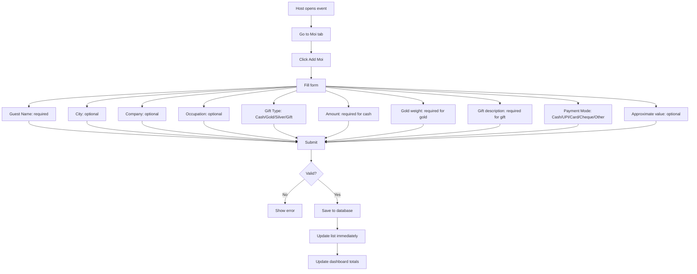

**Key Rules:**
- Guest name required
- Cash amount required
- Gold/Silver require item name and weight
- Gift requires item name
- Approximate value optional
- Offline entries saved to localStorage and synced when online

---

## 4. Admin Dashboard

### 4.1 Admin Dashboard Overview
**User Story:** As the app owner, I want to see key app numbers when I open the admin panel, so that I know the health of the app at a glance.

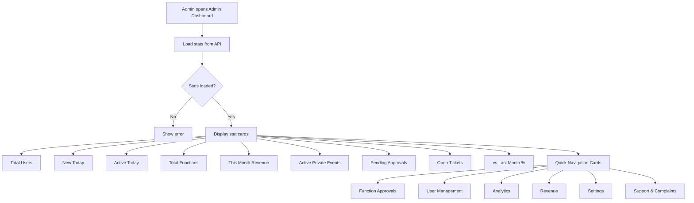

**Key Rules:**
- All numbers load within 3 seconds (single API call)
- Quick navigation to Users, Analytics, Revenue, Settings
- Stat cards show real-time data

---

## 5. Admin User Management

### 5.1 User List & Management
**User Story:** As the app owner, I want to see all users and manage their accounts, so that I can keep the platform safe and clean.

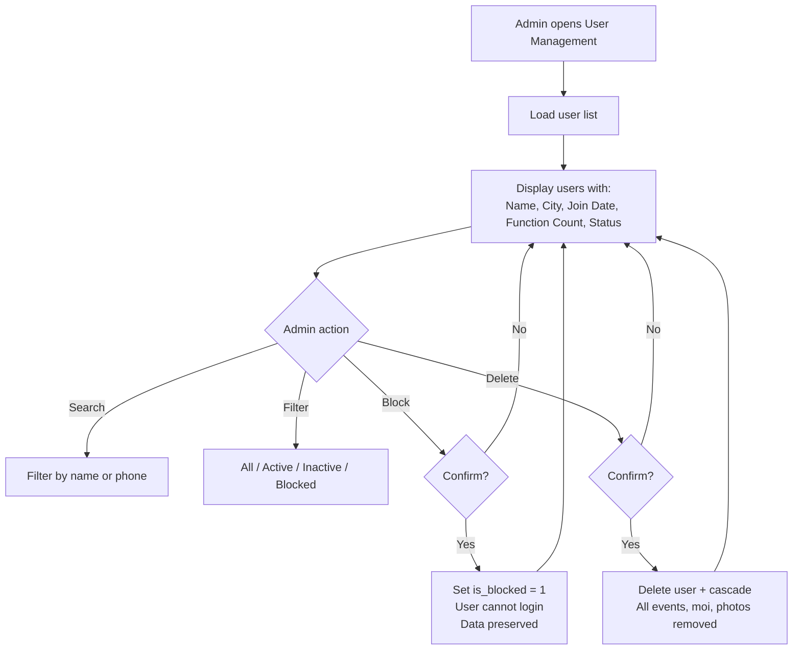

**Key Rules:**
- Shows: name, city, join date, function count, status
- Does NOT show: moi amounts or personal entry details
- Search by name or phone number
- Filter by: All / Active / Inactive / Blocked
- Block → prevents login, data preserved
- Delete → all data permanently removed
- Both actions require confirmation

---

## 6. Admin Analytics

### 6.1 Analytics Dashboard
**User Story:** As the app owner, I want to see graphs and trends of how the app is being used, so that I can make better decisions to grow the platform.

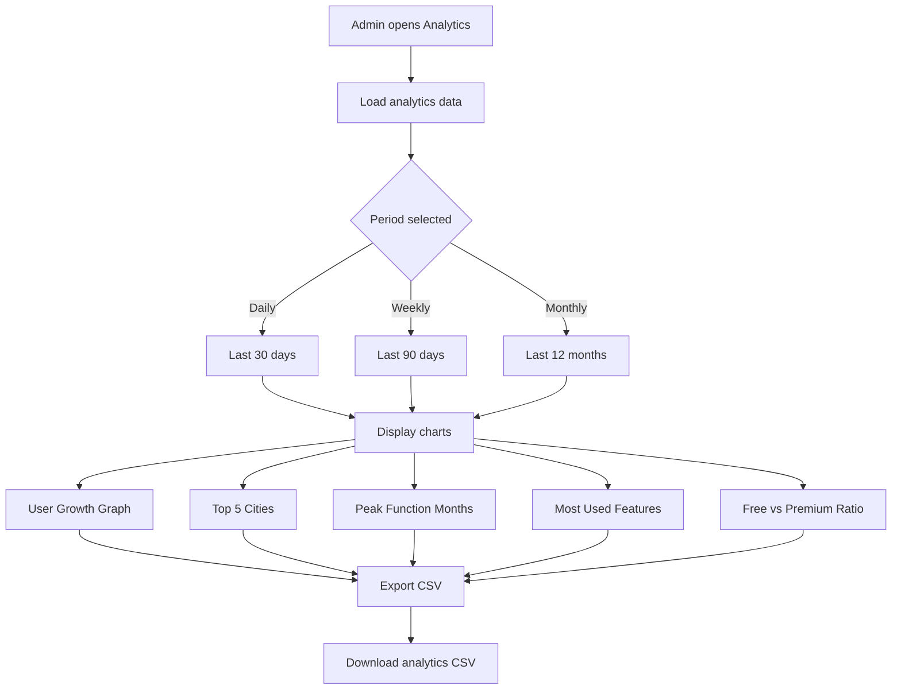

**Key Rules:**
- User growth graph: Daily / Weekly / Monthly view
- Top 5 cities by user count
- Peak function months shown clearly
- Most used features listed by usage count
- Free vs Premium user ratio shown
- All data is anonymous - no personal information
- Export any report as CSV

---

## 7. Admin Support & Complaints

### 7.1 Ticket Management
**User Story:** As the app owner, I want to see and resolve tickets raised by users, so that I can fix problems quickly and keep users happy.

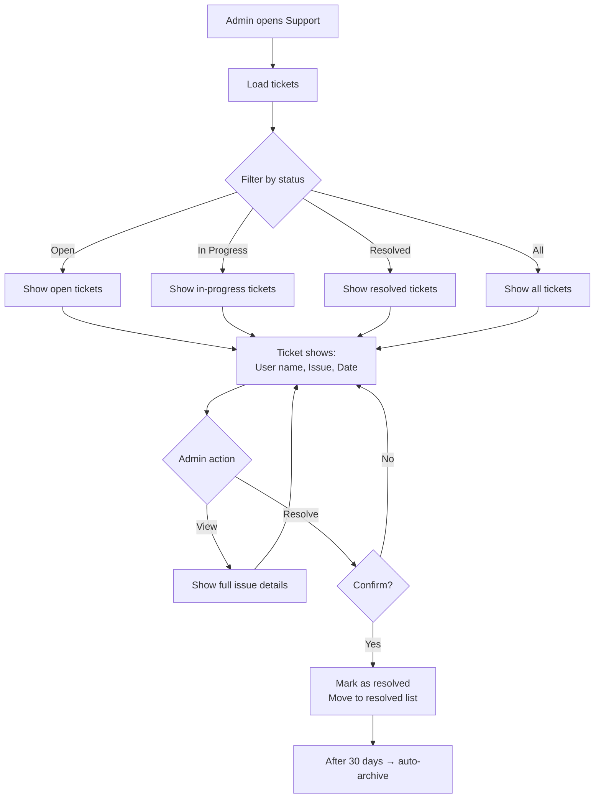

**Key Rules:**
- Shows all tickets: Open / In Progress / Resolved
- Each ticket shows: user name, issue, date submitted
- Can view full issue details
- Mark Resolved moves ticket to resolved list
- Resolved tickets archived after 30 days
- Open ticket count shown on Admin Dashboard

---

## 8. App Settings / Feature Toggles

### 8.1 Feature Toggle Management
**User Story:** As the app owner, I want to turn features on or off across the entire app, so that I can manage the platform without touching the code.

```mermaid
flowchart TD
    A[Admin opens Features module] --> B[Load all feature toggles]
    B --> C[Display table:<br/>Feature key, Description, Status]
    C --> D{Admin action}
    D -->|Enable| E[Set is_enabled = 1]
    D -->|Disable| F[Set is_enabled = 0]
    E --> G[Save to database]
    F --> G
    G --> H[Frontend checks isEnabled()]
    H --> I{Feature enabled?}
    I -->|Yes| J[Show feature in UI]
    I -->|No| K[Hide feature from UI]
```

**Key Rules:**
- Public GET endpoint for frontend feature checks
- Admin-only PUT/POST for updates
- Features use `useFeatures()` hook: `isEnabled('feature_key')`
- Current toggles: `bulk_import`, `multi_organizer`

---

## 9. Notifications

### 9.1 Notification System
**User Story:** As a user, I want to receive notifications about my events, so that I stay informed.

```mermaid
flowchart TD
    A[Event action occurs] --> B{Action type}
    B -->|Approval| C[Insert notification:<br/>"Your function is approved!"]
    B -->|Rejection| D[Insert notification:<br/>"Function Rejected" + reason]
    B -->|Reminder| E[Insert notification:<br/>"3 days before function"]
    B -->|Day-of| F[Insert notification:<br/>"Today is your function!"]
    B -->|Return gift| G[Insert weekly reminder]
    C --> H[User sees bell icon with count]
    D --> H
    E --> H
    F --> H
    G --> H
    H --> I[Click bell → see notifications]
    I --> J[Mark as read]
```

**Key Rules:**
- Notifications stored in `notifications` table
- Linked to user and event
- Polling every 30 seconds
- Shows event name in notification
- Approval/rejection notifications inserted by admin actions

---

## 10. Reports & Export

### 10.1 Moi Reports
**User Story:** As a host, I want to see reports of my moi entries, so that I can understand contributions.

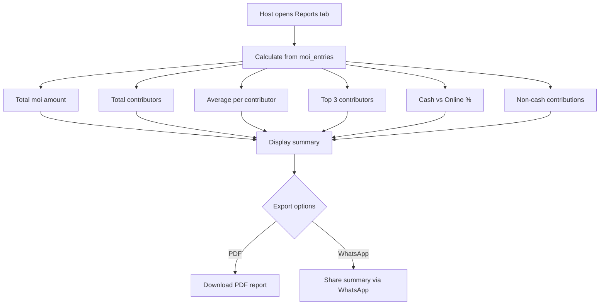

**Key Rules:**
- Breakdown: Cash, Online, Gifts, Other, Gold, Silver
- PDF download available
- WhatsApp share summary
- Top contributors highlighted

---

## 11. Invitation Upload

### 11.1 CSV/XLSX Invitation Upload
**User Story:** As a host, I want to upload my guest list, so that I can track who attended and who gave moi.

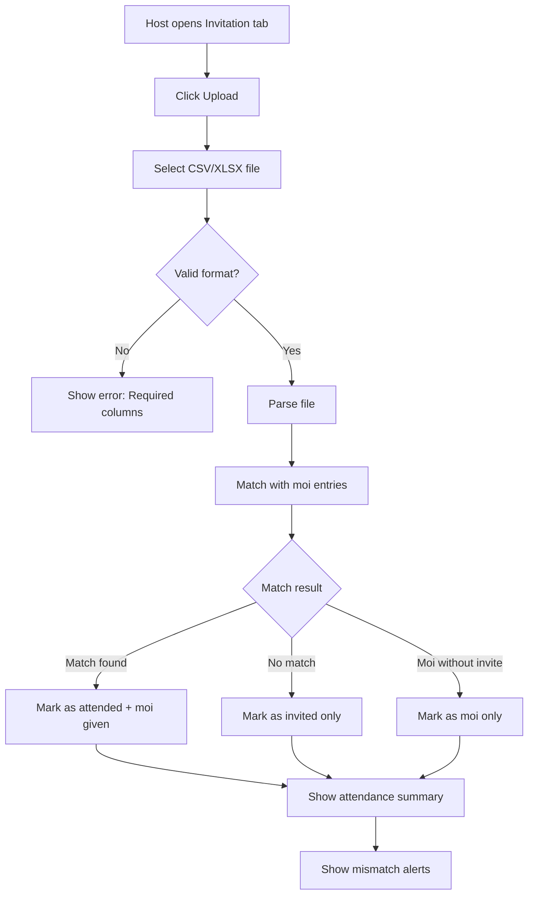

**Key Rules:**
- Accepts CSV/XLSX
- Required columns displayed to user
- Auto-match with moi entries
- Statuses: attended, invited, moi-only
- Mismatch alerts shown

---

## 12. Reminders

### 12.1 Automated Reminders
**User Story:** As a host, I want to receive reminders about my function, so that I don't miss important dates.

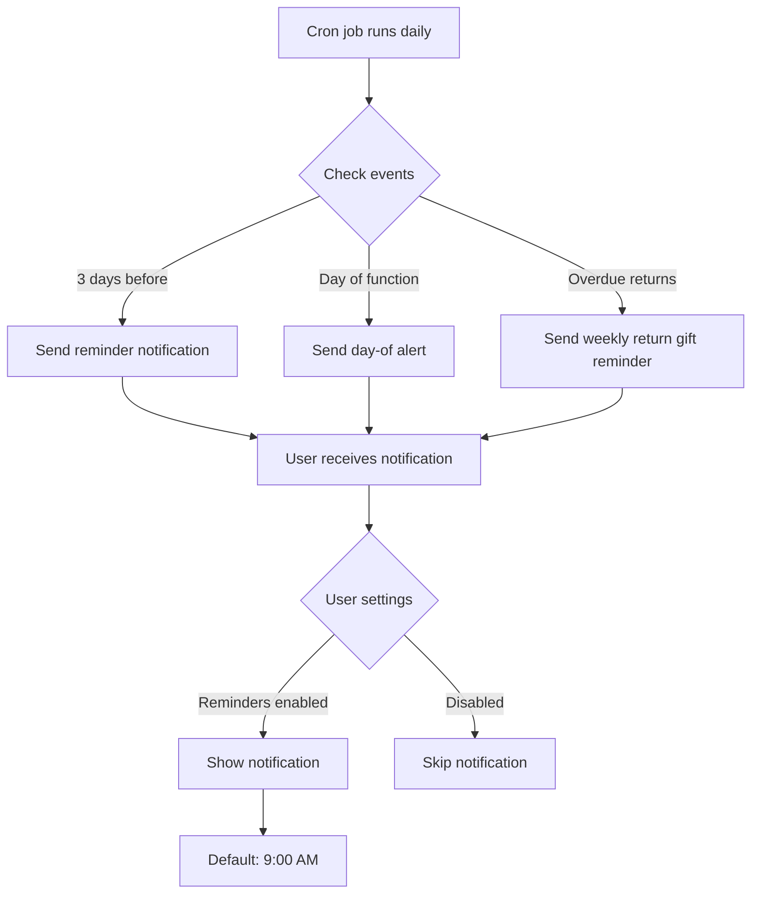

**Key Rules:**
- 3-day before function reminder
- Day-of function alert
- Weekly overdue return gift reminder
- Entry save confirmation notification
- Per-type toggles in Settings
- Default 9:00 AM timing
- Cron-ready script

---

## Appendix: API Endpoints Reference

| Feature | Endpoint | Method | Auth |
|---------|----------|--------|------|
| Phone OTP | `/api/auth.php?action=send-otp` | POST | None |
| Verify OTP | `/api/auth.php?action=verify-otp` | POST | None |
| Admin Login | `/api/auth.php?action=login` | POST | None |
| Get Events | `/api/events.php` | GET | Token |
| Get by Token | `/api/events.php?guest_token=XYZ` | GET | None |
| Add Moi | `/api/moi.php` | POST | None (guest) / Token (admin) |
| Admin Stats | `/api/admin.php?action=stats` | GET | Admin |
| Admin Users | `/api/admin.php?action=users` | GET | Admin |
| Block User | `/api/admin.php?action=block-user` | POST | Admin |
| Delete User | `/api/admin.php?action=delete-user` | POST | Admin |
| Analytics | `/api/admin.php?action=analytics` | GET | Admin |
| Tickets | `/api/admin.php?action=tickets` | GET | Admin |
| Resolve Ticket | `/api/admin.php?action=resolve-ticket` | POST | Admin |
| Feature Toggles | `/api/features.php` | GET | None |
| Update Toggle | `/api/features.php` | PUT | Admin |
| Notifications | `/api/notifications.php` | GET | Token |
| PDF Export | `/api/pdf.php` | GET | Token |
| Bulk Import | `/api/bulk-import.php` | POST | Token |

---

## Appendix: Database Schema Changes

```sql
-- Users table
ALTER TABLE users ADD COLUMN is_premium TINYINT(1) DEFAULT 0;

-- Moi entries
ALTER TABLE moi_entries 
  MODIFY COLUMN gift_type ENUM('cash','gold','silver','gift') NOT NULL DEFAULT 'cash',
  ADD COLUMN approximate_value DECIMAL(10,2) NULL;

-- Login audit logs
CREATE TABLE IF NOT EXISTS login_logs (
    id INT AUTO_INCREMENT PRIMARY KEY,
    user_id INT NULL,
    email VARCHAR(150) NULL,
    role VARCHAR(20) NULL,
    ip_address VARCHAR(45) NULL,
    user_agent TEXT NULL,
    status ENUM('success', 'failed', 'blocked') NOT NULL,
    created_at TIMESTAMP DEFAULT CURRENT_TIMESTAMP,
    FOREIGN KEY (user_id) REFERENCES users(id) ON DELETE SET NULL
);
```
