# Mobile UI Design Review & Recommendations Report

## Executive Summary

This report analyzes the mobile UI design inconsistencies across the MoiApp application and provides recommendations for creating a unified, mobile-first design system suitable for Play Store publication.

---

## 1. Current State Analysis

### 1.1 Design Inconsistencies Identified

#### A. Two Distinct Design Systems

| Area | Design System A (Dashboard) | Design System B (Event Pages) |
|------|----------------------------|------------------------------|
| **Header Style** | `h-14` (56px) with white bg, border-b | `h-[60px]` with purple gradient (`from-[#5B21B6] to-[#7C3AED]`) |
| **Navigation** | Top bar with hamburger menu | Bottom navigation bar (4 tabs) |
| **Sidebar** | `AppSidebar` with `w-60` width | `AppSidebar` with same width but different context |
| **Color Palette** | Uses `tn-*` color tokens | Uses hardcoded hex colors (`#1F2937`, `#6B7280`, etc.) |
| **Typography** | `text-tn-text`, `text-tn-muted` | `text-[#1F2937]`, `text-[#6B7280]` |

#### B. Specific Issues

**Header/Navigation Inconsistencies:**
- `Navbar.tsx` (line 32): Uses `h-[56px] lg:h-[72px]` - inconsistent height
- `MobileHeader.tsx` (line 23): Uses `h-[60px]` with purple gradient
- `EventLayout.tsx` (line 226): Uses `h-14` with white bg
- `HostEntryShell.tsx` (line 84): Uses `h-14` with white bg

**Color System Fragmentation:**
- `tailwind.config.ts` defines `tn-*` color tokens but they're not consistently used
- Event pages use hardcoded colors like `#F9FAFB`, `#1F2937`, `#6B7280`
- Dashboard pages use `tn-light`, `tn-text`, `tn-muted`, `tn-border`

**Icon Positioning Issues:**
- `MobileHeader.tsx` (line 43-61): Right action uses hardcoded SVG arrow icon
- `EventLayout.tsx` (line 260-273): Bottom nav uses `min-w-[64px]` for buttons
- `HostEntryShell.tsx` (line 101-108): Bottom nav uses `min-w-[56px]` - inconsistent sizing

**Layout Structure Differences:**
- Dashboard: Sidebar + Top header + Content
- Event pages: Sidebar + Header + Bottom nav + Content

---

## 2. Mobile-Specific Issues

### 2.1 Touch Target Problems

| Component | Current Size | Recommended Size | Issue |
|-----------|--------------|------------------|-------|
| Bottom nav buttons | `min-w-[56px]` to `min-w-[64px]` | `min-w-[72px]` | May be too small for comfortable tapping |
| Action buttons | `h-12` (48px) | `h-12` to `h-14` | Acceptable but could be larger |
| Icon buttons | `w-10 h-10` | `w-12 h-12` | Slightly small for mobile |

### 2.2 Safe Area Handling

- `MobileHeader.tsx` (line 23): Has `safe-area-top` class
- `globals.css` (line 27): Defines `.safe-area-bottom` utility
- **Missing**: Consistent safe area handling across all mobile views

### 2.3 Responsive Breakpoints

Current breakpoints used inconsistently:
- `md:` - 768px
- `lg:` - 1024px
- Some components use `sm:` (640px)

---

## 3. Mobile App Conversion Analysis

### 3.1 Current PWA Readiness

**Positive Aspects:**
- ✅ Responsive design with Tailwind CSS
- ✅ Mobile navigation patterns implemented
- ✅ Touch-friendly components
- ✅ Service worker support (via Next.js)

**Missing for Native App:**
- ❌ No PWA manifest configuration
- ❌ No offline-first architecture
- ❌ No native device API integration (camera, contacts, etc.)
- ❌ No app splash screens
- ❌ No status bar styling

### 3.2 Play Store Requirements

| Requirement | Status | Notes |
|-------------|--------|-------|
| PWA to APK conversion | Possible via TWA | Need to add manifest, service worker |
| App icons (multiple sizes) | Missing | Need 48x48, 72x72, 96x96, 144x144, 192x192, 512x512 |
| App splash screen | Missing | Need 320x320, 640x640, 1024x1024 |
| Offline support | Partial | Some data caching but not comprehensive |
| Push notifications | Missing | Would need Firebase integration |

---

## 4. Recommended Solution Architecture

### 4.1 Unified Design System

```mermaid
graph TD
    A[Design System] --> B[Color Tokens]
    A --> C[Typography Scale]
    A --> D[Spacing System]
    A --> E[Component Library]
    
    B --> B1[tn-primary: #FFC107]
    B --> B2[tn-secondary: #4B218B]
    B --> B3[tn-background: #F9FAFB]
    B --> B4[tn-surface: #FFFFFF]
    B --> B5[tn-text-primary: #101010]
    B --> B6[tn-text-secondary: #444444]
    
    C --> C1[Display: 24-32px]
    C --> C2[Heading: 18-20px]
    C --> C3[Body: 14-16px]
    C --> C4[Label: 12-14px]
    C --> C5[Caption: 10-12px]
    
    D --> D1[Grid: 4px base]
    D --> D2[Touch targets: 48px min]
    D --> D3[Screens: 16px padding]
    
    E --> E1[MobileHeader]
    E --> E2[BottomNavigation]
    E --> E3[EventCard]
    E --> E4[StatCard]
    E --> E5[ActionButton]
```



### 4.2 Component Consolidation Plan

#### A. Create Unified Mobile Header Component

**Current Issues:**
- `MobileHeader.tsx` - Purple gradient style
- `EventLayout.tsx` header - White style
- `HostEntryShell.tsx` header - White style
- `Navbar.tsx` mobile view - Different structure

**Proposed Solution:**
Create a single `MobileHeader` component that:
1. Uses consistent height (`h-14` or `h-16`)
2. Supports both light and dark variants
3. Has proper safe area padding
4. Consistent back button positioning

#### B. Unify Bottom Navigation

**Current Issues:**
- `EventLayout.tsx` (line 260-273): 4 tabs, `min-w-[64px]`
- `HostEntryShell.tsx` (line 101-108): Variable tabs, `min-w-[56px]`

**Proposed Solution:**
Create a `BottomNavigation` component with:
1. Consistent tab width (`min-w-[72px]`)
2. Configurable number of tabs
3. Active state styling
4. Safe area bottom padding

#### C. Standardize Color Usage

Replace all hardcoded colors with `tn-*` tokens:

| Hardcoded | Replace With |
|-----------|--------------|
| `#F9FAFB` | `tn-light` |
| `#1F2937` | `tn-text` |
| `#6B7280` | `tn-muted` |
| `#E5E7EB` | `tn-border` |
| `#FFFFFF` | `white` or `tn-surface` |
| `#4B218B` | `tn-purple` |

---

## 5. Implementation Roadmap

### Phase 1: Design System Unification (Week 1-2)

- [ ] Create unified `MobileHeader` component
- [ ] Create unified `BottomNavigation` component
- [ ] Update `tailwind.config.ts` with complete color palette
- [ ] Replace hardcoded colors in event pages
- [ ] Standardize typography scales

### Phase 2: Mobile Optimization (Week 2-3)

- [ ] Increase touch targets to 48px minimum
- [ ] Add safe area handling to all mobile views
- [ ] Optimize forms for mobile input
- [ ] Improve button spacing and hit areas
- [ ] Add mobile-specific gestures (swipe actions)

### Phase 3: PWA Enhancement (Week 3-4)

- [ ] Add PWA manifest configuration
- [ ] Create app icons in all required sizes
- [ ] Add offline support for core features
- [ ] Implement service worker caching
- [ ] Add splash screens

### Phase 4: Play Store Preparation (Week 4-5)

- [ ] Set up Trusted Web Activity (TWA)
- [ ] Configure Android app signing
- [ ] Create store listing assets
- [ ] Test on Android devices
- [ ] Submit to Play Store

---

## 6. Detailed Component Analysis

### 6.1 Header Components Comparison

| File | Height | Background | Back Button | Menu Button | Title Style |
|------|--------|------------|-------------|-------------|-------------|
| `Navbar.tsx` | `h-[56px] lg:h-[72px]` | `bg-white` | N/A (desktop) | Hamburger | `text-xl font-extrabold` |
| `MobileHeader.tsx` | `h-[60px]` | `bg-gradient-to-r from-[#5B21B6] to-[#7C3AED]` | N/A | Hamburger | `text-[18px] font-semibold text-white` |
| `EventLayout.tsx` | `h-14` | `bg-white` | Arrow icon | Menu icon | `text-lg font-bold` |
| `HostEntryShell.tsx` | `h-14` | `bg-white` | Arrow icon | Menu icon | `text-base font-bold` |

### 6.2 Navigation Patterns

**Dashboard Navigation:**
- Sidebar on desktop (60px collapsed, 240px expanded)
- Hamburger menu on mobile
- No bottom navigation

**Event Page Navigation:**
- Sidebar on desktop
- Hamburger menu on mobile
- **Bottom navigation with 4 tabs** (Dashboard, Entries, Reports, Settings)

**Recommendation:** Keep bottom navigation for event pages but make it consistent across all mobile views.

---

## 7. Mobile-Specific Recommendations

### 7.1 Touch Target Improvements

```css
/* Current */
.min-w-\[56px\] { min-width: 56px; }
.min-w-\[64px\] { min-width: 64px; }

/* Recommended */
.min-w-\[72px\] { min-width: 72px; } /* 48px touch + 24px padding */
```

### 7.2 Safe Area Handling

Add to `globals.css`:
```css
.safe-area-top {
  padding-top: env(safe-area-inset-top, 0px);
}

.safe-area-left {
  padding-left: env(safe-area-inset-left, 0px);
}

.safe-area-right {
  padding-right: env(safe-area-inset-right, 0px);
}
```

### 7.3 Form Optimization for Mobile

Current issues in `moi-entry/page.tsx`:
- Small input fields (`px-4 py-3`)
- Grid layout for some fields may be too cramped
- No input type optimization

Recommendations:
- Increase input padding to `px-4 py-3.5`
- Use single column on mobile for forms
- Add proper input types (tel, number, email)
- Increase font size for better readability

---

## 8. PWA Configuration for Play Store

### 8.1 Required Files

```
frontend/public/
├── manifest.json
├── icons/
│   ├── icon-48x48.png
│   ├── icon-72x72.png
│   ├── icon-96x96.png
│   ├── icon-144x144.png
│   ├── icon-192x192.png
│   └── icon-512x512.png
└── splash/
    ├── splash-320x320.png
    ├── splash-640x640.png
    └── splash-1024x1024.png
```

### 8.2 Manifest Configuration

```json
{
  "name": "MoiApp - Wedding Gift Tracker",
  "short_name": "MoiApp",
  "description": "Track wedding moi (gift money) easily",
  "start_url": "/",
  "display": "standalone",
  "background_color": "#FFFFFF",
  "theme_color": "#FFC107",
  "icons": [
    {
      "src": "/icons/icon-192x192.png",
      "sizes": "192x192",
      "type": "image/png"
    },
    {
      "src": "/icons/icon-512x512.png",
      "sizes": "512x512",
      "type": "image/png"
    }
  ]
}
```

---

## 9. Priority Action Items

### High Priority (Must Fix)

1. **Unify header components** - Create single `MobileHeader` with variants
2. **Standardize color system** - Replace all hardcoded colors with `tn-*` tokens
3. **Fix bottom navigation inconsistency** - Use consistent tab widths
4. **Add safe area padding** - Prevent content overlap on notch devices

### Medium Priority (Should Fix)

1. **Increase touch targets** - Ensure 48px minimum for interactive elements
2. **Optimize forms for mobile** - Better spacing, input types, validation
3. **Add PWA manifest** - Required for Play Store
4. **Create app icons** - All required sizes for store listing

### Low Priority (Nice to Have)

1. **Add pull-to-refresh** - Native mobile pattern
2. **Implement swipe actions** - For entry list items
3. **Add haptic feedback** - For button presses
4. **Dark mode support** - For better battery life

---

## 10. Testing Recommendations

### 10.1 Device Testing Matrix

| Device Type | Screen Size | Priority |
|-------------|-------------|----------|
| iPhone SE | 375x667 | High |
| iPhone 14 Pro | 390x844 | High |
| Samsung Galaxy S21 | 384x854 | High |
| iPad Mini | 768x1024 | Medium |
| Desktop | 1024px+ | Reference |

### 10.2 Key Test Scenarios

1. Navigation flow between all pages
2. Form submission on mobile
3. Bottom navigation accessibility
4. Safe area handling on notch devices
5. Offline functionality
6. Performance on low-end devices

---

## 11. Conclusion

The MoiApp has a solid foundation for mobile but suffers from:
- **Inconsistent design patterns** between dashboard and event pages
- **Fragmented color system** with hardcoded values
- **Inconsistent touch targets** and navigation patterns
- **Missing PWA configuration** for Play Store

**Recommended approach:**
1. First unify the design system (colors, headers, navigation)
2. Then optimize for mobile touch interactions
3. Finally, add PWA configuration for Play Store deployment

This will result in a more maintainable codebase and a better user experience across all devices.

---

## 12. Completed Changes (This Session)

### 12.1 Design System Unification

- [x] Created `frontend/components/ui/UnifiedComponents.tsx` with reusable components:
  - `UnifiedInput` - Standardized form input styling
  - `UnifiedSelect` - Standardized select dropdown styling
  - `UnifiedStatCard` - Consistent stat card design
  - `UnifiedQuickAction` - Unified quick action button
  - `UnifiedPrimaryButton` - Primary button with black text on yellow
  - `UnifiedSecondaryButton` - Secondary button styling
  - `UnifiedFilterButton` - Filter button for date/payment filters
  - `UnifiedPaymentButton` - Payment method button

- [x] Updated `EventLayout.tsx` bottom navigation:
  - Changed active tab color from `text-tn-purple` to `text-tn-yellow`
  - Changed label size from `text-[10px]` to `text-xs`

- [x] Updated `HostEntryShell.tsx` bottom navigation:
  - Changed active tab color from `text-tn-purple` to `text-tn-yellow`
  - Changed label size from `text-[10px]` to `text-xs`
  - Fixed bottom content padding from `pb-28` to `pb-20`

- [x] Updated `moi-entry/page.tsx`:
  - Changed save button text from `text-white` to `text-black`

- [x] Updated `reports/page.tsx`:
  - Changed loading spinner to use `tn-yellow` color
  - Changed error state to use `tn-subtle` color
  - Fixed PDF export error handling (handles HTML responses)
  - Fixed Excel export to use actual CSV endpoint

- [x] Updated `dashboard-empty/page.tsx`:
  - Changed primary button text from `text-white` to `text-black`

- [x] Updated `entries/page.tsx`:
  - Fixed fixed bottom button position from `bottom-[68px]` to `bottom-16`
  - Updated button colors to use `tn-*` tokens

- [x] Updated guest form pages:
  - `g/[token]/form/page.tsx` - Converted to `tn-*` color system
  - `g/[token]/GuestPaymentClient.tsx` - Updated header text colors

- [x] Updated `.htaccess`:
  - Added rule to exclude direct API file access from rewrites

### 12.2 Export Functionality Fixes

- [x] PDF Export: Added proper error handling for non-JSON responses
- [x] Excel Export: Replaced placeholder with actual CSV export via `/api/export.php?format=csv`

### 12.3 Color System Standardization

All event pages now use the unified `tn-*` color system:
- `tn-yellow` (#FFC107) - Primary action color
- `tn-text` (#101010) - Primary text
- `tn-muted` (#444444) - Secondary text
- `tn-light` (#FAFAFA) - Background
- `tn-light-alt` (#F9FAFB) - Card background
- `tn-border` (#E8E8E8) - Border color
- `tn-success` (#22C55E) - Success/positive values
- `tn-warning` (#F59E0B) - Warning color